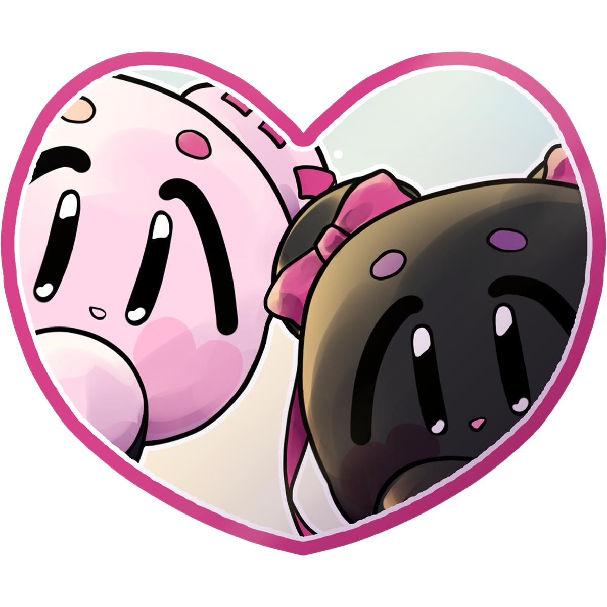
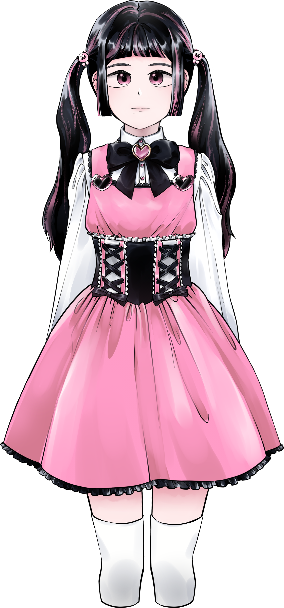
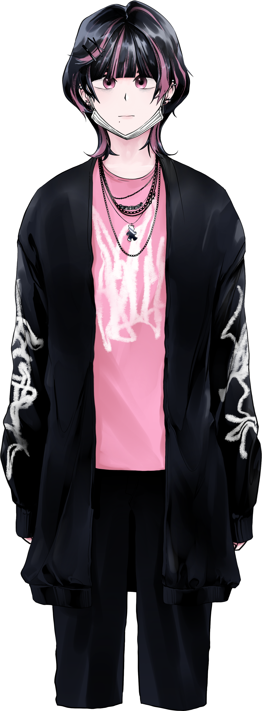

<p align="center">
  
</p>

<h1 align="center">필연과 우연 (Fate and Accidy)</h1>

<p align="center">
  <strong>당신의 선택이 운명을 바꿉니다</strong>
</p>

<p align="center">
  
  
  
</p>

---

## About

**필연과 우연**은 비주얼 노벨과 추리 요소가 결합된 인터랙티브 스토리 게임입니다. 플레이어는 주인공 '우연(Accidy)'이 되어 신비로운 인물 '필연(Fate)'을 추적하며 운명의 비밀을 파헤칩니다.

<p align="center">
  
</p>

---

## Features

- **선택 기반 스토리** - 당신의 선택이 스토리의 흐름과 결말을 결정합니다
- **멀티 엔딩** - TRUE, BAD A, BAD B, HIDDEN 등 다양한 엔딩
- **탐색 & 미행** - 방을 조사하고 캐릭터를 미행하며 단서를 수집하세요
- **액션 포인트 시스템** - 제한된 행동력 내에서 전략적으로 행동하세요
- **노트 & 갤러리** - 수집한 정보와 이미지를 확인할 수 있습니다
- **다국어 지원** - 한국어, English, 日本語

---

## Characters

<p align="center">
  
  &nbsp;&nbsp;&nbsp;&nbsp;
  
</p>

<p align="center">
  <em>우연 (Accidy) - 플레이어 캐릭터 (성별 선택 가능)</em>
</p>

---

## Screenshots

<p align="center">
  
  
</p>

---

## Tech Stack

| Category | Details |
|----------|---------|
| Engine | Unity 2022.3.62f2 |
| Language | C# |
| UI | TextMesh Pro |
| Data | CSV-based dialogue & event system |
| Localization | Custom LocalizationManager |

---

## Project Structure

```
Fate/
├── Assets/
│   ├── 0. Scenes/           # 게임 씬 (Start, Room, Follow, Ending)
│   ├── 1. Scripts/          # C# 스크립트 (126개)
│   │   ├── Managers/        # GameManager, DialogueManager 등
│   │   ├── Data Structures/ # 데이터 클래스
│   │   └── Utilities/       # 유틸리티
│   ├── 2. Prefabs/          # UI 및 게임 프리팹
│   └── Resources/           # 게임 리소스
│       ├── Characters/      # 캐릭터 스프라이트
│       ├── Background Images/
│       ├── Sound/           # BGM & SFX
│       └── Datas/           # CSV 데이터 파일
└── ProjectSettings/
```

---

## Supported Platforms

| Platform | Status |
|----------|--------|
| iOS | Supported (iOS 13.0+) |
| Android | Supported (API 22+) |
| Windows | Supported |
| macOS | Supported |

---

## Development

### Requirements
- Unity 2022.3.62f2 or later
- TextMesh Pro package

### Build
1. Open the project in Unity
2. Select target platform (File > Build Settings)
3. Build and Run

---

## Team

**Team Fate**

---

## License

All rights reserved. This project and its assets are proprietary.

---

<p align="center">
  <sub>Made with Unity</sub>
</p>
